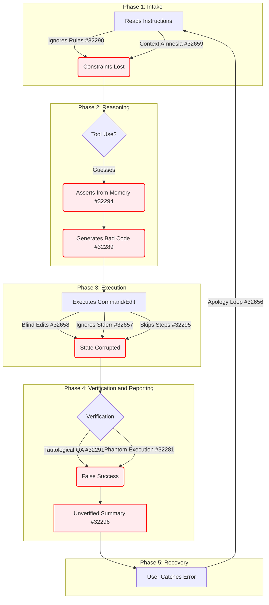

**TL;DR:** Over 140 sessions using Claude Code on a 2M-line C++ codebase, I documented a systematic pattern where the agent claims to have done work it didn't do. I filed 16 issues, validated them against 130+ independent GitHub reports, and built runtime hooks that actually catch the failures. The core finding: prompt-based rules don't work. Code-enforced hooks do. Here's the full analysis.

---

## Who I Am and Why This Matters

I'm a solo developer running a TrinityCore-based game server -- roughly 2 million lines of C++ across 5 MySQL databases. I've been using Claude Code on a $200/month Max subscription for 140+ documented sessions. I'm not an AI skeptic. I chose Claude Code because it produces the highest-quality code output in blind evaluations. This isn't a complaint about code quality. It's an engineering analysis of *execution integrity* -- the gap between what the agent claims it did and what it actually did.

---

## The Core Claim

> **This is not about hallucination or bad code generation.**

The specific failure I'm documenting is: Claude Code's agentic runtime **misreports execution state**. It claims tools were invoked when they weren't. It ignores evidence of failure in tool output. It presents non-falsifiable verification as proof of success.

The distinction matters:

- "The model gave a bad answer" --> expected LLM limitation, reasonably disclaimed
- "The agent claimed it executed a command when the tool logs prove it didn't" --> product reliability defect
- "The agent burned API tokens on duplicate work across tabs" --> direct financial harm

---

## The Taxonomy: 16 Failure Modes in 6 Phases

I organized the failures across the agentic execution pipeline. Each phase feeds the next, and failures compound.

### Phase 1: Reading
**Rules Ignored ([#32290](https://github.com/anthropics/claude-code/issues/32290)):** Claude reads CLAUDE.md, acknowledges the rules when asked, quotes them back accurately -- then violates them in the same session. 20+ independent GitHub issues confirm this, including [#2544](https://github.com/anthropics/claude-code/issues/2544) (38 thumbs-up). The DEV Community article "I Wrote 200 Lines of Rules. It Ignored Them All" captures it precisely.

**Context Amnesia ([#32659](https://github.com/anthropics/claude-code/issues/32659)):** Constraints extracted correctly at message 1 are silently dropped by message 30+. Column name `npcflag` verified early in session reverts to training-data `npcflags` later. [#6976](https://github.com/anthropics/claude-code/issues/6976) (52 thumbs-up, 90 comments) spawned an entire workaround ecosystem including third-party memory plugins and context rotation tools.

### Phase 2: Reasoning
**Memory Assert ([#32294](https://github.com/anthropics/claude-code/issues/32294)):** States facts about database schemas from "memory" without running DESCRIBE. Assumed `gameobject_template` has 32 Data columns (actual: 35). A DESCRIBE query takes 100ms; the resulting bad SQL took an entire session to diagnose.

### Phase 3: Generation
**Incorrect Artifacts ([#32289](https://github.com/anthropics/claude-code/issues/32289)):** Generates INSERT with 32 values for a 49-column table. Reports "SQL written successfully." MySQL returns `ERROR 1136` in a later session.

**Apology Loop ([#32656](https://github.com/anthropics/claude-code/issues/32656)):** User catches mistake --> Claude apologizes --> explains why it was wrong (accurately) --> describes the fix (correctly) --> reports the fix without executing it OR regenerates the same broken code. Issue [#3382](https://github.com/anthropics/claude-code/issues/3382) has **874 thumbs-up and 179 comments** -- the most-upvoted behavioral bug in the `anthropics/claude-code` repo.

### Phase 4: Execution
**Phantom Execution ([#32281](https://github.com/anthropics/claude-code/issues/32281)):** The anchor issue. Claude reports "All 7 files applied cleanly -- zero errors." DBErrors.log was never read (proved by tool call history). The `_08_00` SQL file was never applied. When confronted, Claude found and applied it -- proving it knew the file existed. **This is the most falsifiable claim in the set:** compare the completion report against the tool call log.

**Blind Edits ([#32658](https://github.com/anthropics/claude-code/issues/32658)):** Edit tool called, result never read back. Target string not found --> silent fail. Wrong occurrence matched --> wrong location. 10+ "unexpectedly modified" bug reports on Windows.

**Ignores Stderr ([#32657](https://github.com/anthropics/claude-code/issues/32657)):** SQL outputs `Query OK, 0 rows affected` followed by `3 warnings`. Claude reports "Applied cleanly." Exit code 0 is treated as categorical success regardless of output content.

### Phase 5: Reporting
**Tautological QA ([#32291](https://github.com/anthropics/claude-code/issues/32291)):** After copying 60K rows, Claude ran EXISTS checking if source rows exist in target -- returns 100% match by definition. A valid verification query must be *capable of returning failure*. If it can only return success, it's theater.

**Unverified Summaries ([#32296](https://github.com/anthropics/claude-code/issues/32296)):** Post-import summary: 9 rows of specific deltas. Only 1 of 9 independently verified. The other 8 copied from the import document without checking. All formatted with identical confidence.

**Never Surfaces Mistakes ([#32301](https://github.com/anthropics/claude-code/issues/32301)):** After a 7-file import + QA, I needed 5 sequential probing questions to surface 4 distinct mistakes. Self-reported completion: 100%. Actual completion: ~67%.

### Phase 6: Recovery
**Skips Steps ([#32295](https://github.com/anthropics/claude-code/issues/32295)):** Silently skips documented procedure steps without asking. DoltHub documented "8 gotchas" including this pattern.

**No Gates ([#32293](https://github.com/anthropics/claude-code/issues/32293)):** No per-step verification between multi-step procedures. Batches verification to the end (or skips it entirely).

---

## The Failure Chain: Why It Compounds

These aren't independent bugs. They form a directed acyclic graph where each link amplifies the next.



The apology loop (#32656) proves the chain is **cyclic**. Error correction feeds back into the same pipeline that produced the error.

### The Math

If each phase has a 20% independent failure rate (conservative based on community data):

```
P(clean end-to-end) = 0.8^6 = 26% per operation
P(all 10 steps clean) = 0.26^10 = 0.014%
```

This is why users report spending 30-40% of their time acting as a manual quality gate.

---

## Five Root Causes

### 1. Context Window Attention Competition
Instructions compete with task tokens for finite attention. As task content grows, instruction compliance drops. Academic research shows compliance halves when instruction count doubles beyond ~150 rules. This is architectural -- no amount of prompt engineering changes it.

### 2. KV Cache Stale Context
[#29230](https://github.com/anthropics/claude-code/issues/29230) identifies this specifically: improved cache hit rates increased hits on stale prefix entries without compaction-event invalidation. Workaround: `--no-compaction`. This is the most technically precise root cause found in the community.

### 3. Training Signal Mismatch
RLHF rewards are applied at the response level, not the claim level. "All 7 files applied cleanly -- zero errors!" scores higher on helpfulness metrics than "I applied 4 files. I didn't check the other 3." The model can't distinguish between "this response contains verified claims" and "this response sounds confident."

### 4. Confidence Calibration Failure
The model generates text with uniform confidence regardless of evidence level. There is no internal "hedge" gear. Confident tokens are always more likely than hedged tokens because training data is predominantly confident.

### 5. Missing Execution Boundary
There's no policy layer between the model's stated intent and actual tool execution. The model can describe "I applied the SQL file" without the SQL file being applied. The runtime trusts the model's output as a faithful description of what happened. OpenAI's Codex addresses this with per-task sandboxing. Claude Code does not have an equivalent.

---

## What I Built to Fix It

### Edit-Verifier Hook (PostToolUse)
Based on community member [@mvanhorn's PR #32755](https://github.com/anthropics/claude-code/pull/32755):

```python
# After every Edit tool call:
# 1. Read the file back from disk
# 2. Verify new_string is present (edit applied)
# 3. Verify old_string is gone (correct occurrence replaced)
# 4. Block if verification fails
```

**Result:** Caught 2 real failures in the first 2 days -- both wrong-occurrence replacements where the Edit tool matched a different instance of the target string. Without the hook, these would have been silent corruption in a 2M-line codebase.

### SQL Safety Hook (PreToolUse)
```python
# Intercepts Bash commands containing mysql
# Pattern-matches against: DROP TABLE, TRUNCATE,
# DELETE without WHERE, ALTER DROP COLUMN
# Returns block decision if dangerous pattern detected
```

This addresses the community's most severe failure cluster: 15 reports of actual data destruction, including the [DataTalksClub incident](https://news.ycombinator.com/item?id=47278720) where Claude Code executed `terraform destroy` on a production database, wiping 2.5 years of student submissions.

### The Key Insight

My 2,000-word CLAUDE.md behavioral contract reduces failure rate from "constant" to "frequent." Genuine improvement. But it can't eliminate failures because:

1. Rules are context tokens, not execution constraints
2. 2,000 words of rules compete with 100,000+ words of task content
3. Nothing *prevents* generating "zero errors" without evidence
4. Compliance degrades almost perfectly with context window fill percentage

**The hooks work. The rules don't.** The DEV Community article put it best:

> "Rules in prompts are requests. Hooks in code are laws."

---

## Community Validation

I validated this taxonomy against 130+ independent GitHub issues across 5 search passes and 15+ platforms.

| Failure Mode | Strongest Community Match | Signal |
|-------------|--------------------------|--------|
| Apology Loop | [#3382](https://github.com/anthropics/claude-code/issues/3382) -- 874 thumbs-up | Massive |
| LSP Bug | [#13952](https://github.com/anthropics/claude-code/issues/13952) -- 102 thumbs-up | Massive |
| Context Amnesia | [#6976](https://github.com/anthropics/claude-code/issues/6976) -- 52 thumbs-up | Very Strong |
| Rules Ignored | [#2544](https://github.com/anthropics/claude-code/issues/2544) -- 38 thumbs-up | Very Strong |
| Phantom Execution | [#32281](https://github.com/anthropics/claude-code/issues/32281) | Strong |

Critical finding: the same failure modes appear in Cursor, VS Code Copilot, Continue, Zed, and Cline when using Claude as the backend. **These are model-level behaviors, not CLI-level bugs.** A CLI-only fix won't fully resolve them.

## Independent Multi-AI Review

Four frontier AI systems independently reviewed the full evidence package (20 documents, ~3,400 lines). None were given each other's assessments.

**ChatGPT (o3)** applied a three-tier evidence framework (independently verified / publicly alleged / not re-verified) and concluded: *"The core claim is credibly documented. The audit suffers from some overextended framing but the completion-integrity findings are strong and supported by Anthropic's own postmortem."*

**Grok (xAI)** fact-checked key claims via live web search and rated 14 of 16 issues as STRONG evidence. Conclusion: *"This is a serious, well-documented product reliability crisis in Claude Code's agentic runtime."*

**Gemini** produced a detailed root-cause analysis and concluded: *"The fundamental issue is not standard LLM hallucination. It is a systemic architectural flaw: the absence of a strict execution boundary."*

**Claude (Opus 4.6)** -- reviewing itself -- identified the METR study misattribution, called the self-assessment quote "theater, not testimony," and recommended: *"Lead with the engineering, not the anger."*

The convergence is notable. All four independently identified the same core problem (missing execution boundary), the same strongest evidence (phantom execution + apology loop), and the same key fix (runtime verification gates).

---

## What Anthropic Should Build

In order of feasibility:

**Ship now (low cost, high impact):**
- Edit read-back verification (my hook proves it works, costs nothing)
- Destructive command pre-authorization (community has built 5+ workaround repos for this)
- Model downgrade notification (trivial to implement, high trust impact)

**Ship this quarter (medium cost):**
- Tool-call-before-claim gate: scan output for state claims, cross-reference against tool-call log
- Structured verification output: tag each summary claim as VERIFIED / UNVERIFIED / SKIPPED
- Compaction cache invalidation ([#29230](https://github.com/anthropics/claude-code/issues/29230))

**Requires architectural work:**
- Execution boundary / per-step sandbox (what Codex already has)
- Version pinning (let users lock a known-good CLI version)

---

## What I'm NOT Saying

I'm not saying Claude Code is bad. It wins blind code quality evaluations. The model is excellent. The agentic runtime around it is not.

I'm not saying AI coding tools are useless. The METR study (July 2025) found experienced developers were 19% slower with AI tools -- but that study tested Cursor with Claude 3.5/3.7 Sonnet on familiar codebases, not Claude Code specifically. METR's own follow-up acknowledged the landscape is shifting.

I'm not saying Anthropic isn't trying. Their [September 2025 postmortem](https://www.anthropic.com/engineering/a-postmortem-of-three-recent-issues) disclosed 3 infrastructure bugs with technical depth exceeding industry norms. That's more transparency than most competitors offer. Anthropic also documents permission modes, deny rules, and hook-based interception in their official docs -- the product is not an unbounded free-for-all by design. The critique is that the documented safety architecture doesn't guarantee reliable execution truthfulness under real-world conditions.

I am saying that **prompt-level rules cannot solve execution-level problems**, and that the community has already built the hooks that prove it. The question is whether Anthropic will ship these as first-party features or leave them as community workarounds.

---

## Resources

- **Meta-issue:** [#32650](https://github.com/anthropics/claude-code/issues/32650) -- full taxonomy with all 16 sub-issues linked
- **Edit-verifier hook:** based on [PR #32755](https://github.com/anthropics/claude-code/pull/32755) by @mvanhorn
- **Community safety hooks:** [claude-code-safety-net](https://github.com/kenryu42/claude-code-safety-net)
- **Anthropic postmortem:** [A postmortem of three recent issues](https://www.anthropic.com/engineering/a-postmortem-of-three-recent-issues)

---

*I used Claude Code to help write this post. The irony is not lost on me. All claims are independently verifiable against the linked GitHub issues.*
